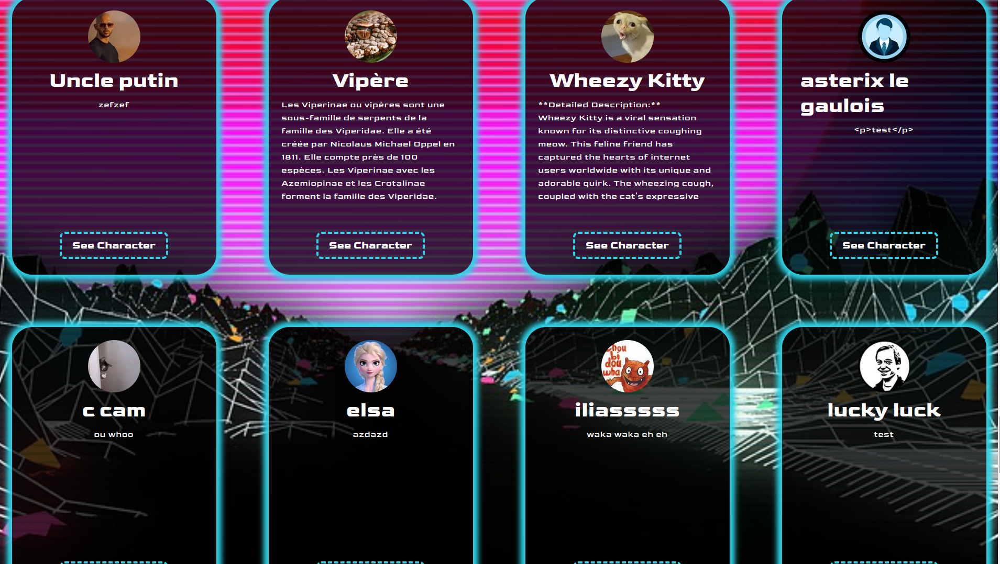

# hamilton-8-character-manager-group-project-ozlemm-lucie
hamilton-8-character-manager-group-project-ozlemm-lucie created by GitHub Classroom

# hamilton-8-character-manager-group-project-ozlemm-lucie
hamilton-8-character-manager-group-project-ozlemm-lucie created by GitHub Classroom

## Liens du site Ozlem & Lucie 
https://64a41b2e1ab75d0b68c27326--gilded-fudge-921635.netlify.app/

### Objectives
- Use best JS practices
- Read documentation and test a REST API
- Use a REST API with HTTP requests
- Create a typical asynchronous flow : send asynchronous (promises or async/await) requests to a remote server and process the results
- DOM manipulation: changing the DOM based on results of HTTP requests

### Numbers Pages : 4
- Character list
- Character editor
- Character creation
- Character Single

